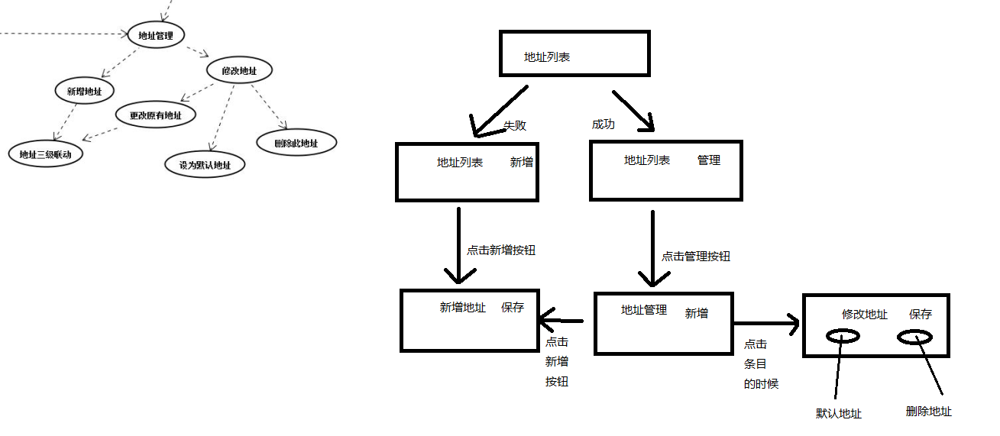

## JDMall

实战项目京东商城

##引入第三方开源框架的方式
* 直接将jar包或者aar包拷入lib文件夹下

##结算中心的地址思路分析

##技能点get√
1. Fragment的点击穿透的问题,只需要在Fragment的根布局里面设置android:clickable="true"

		<?xml version="1.0" encoding="utf-8"?>
		<FrameLayout xmlns:android="http://schemas.android.com/apk/res/android"
					 android:id="@+id/fl_content_container"
					 android:clickable="true"
					 android:layout_width="match_parent"
					 android:layout_height="match_parent"
					 android:orientation="vertical">
	
		</FrameLayout>
2.加载图片使用picasso第三方库,jar包为picasso-5.5.2.jar,存放在lib中

		问题:	当需要加载圆形图片时,github上作者介绍是在线引用两个地址:
				compile 'jp.wasabeef:picasso-transformations:2.0.0'
					// If you want to use the GPU Filters
				compile 'jp.co.cyberagent.android.gpuimage:gpuimage-library:1.3.0'
		原因:	使用时出现和picasso的jar起冲突,报出一个megerdebug的错误,是transformations那个地址,
				在第一次引用时,存在依赖加载,会去主动加载picasso的jar包,此时与项目中已有的起冲突;
		解决:	1.在线引用,删除原有的picasso的jar包或引用
				2.将上面两个文件下载下来,放在lib中,grdle中改为以下形式:
					compile(name:'picasso-transformations-2.0.0', ext: 'aar')
					compile files('lib/gpuimage-library-1.3.0.jar')

3.屏幕适配问题

		1.可以先获得当前设备的DensityDpi
		/**
		 * 获得当前设备DensityDpi
		 * @return
		 */
		public static float getDensityDpi() {
			return ResUtil.getResource().getDisplayMetrics().densityDpi;
		}

		2.再通过Dpi逐个判断,假设我想设置一个TextView的文本大小
		public float getTextSizeByDensity(){
			float size = 0;
			switch ((int) DensityUtil.getDensityDpi()) {
				case 120:
					size = 20;
					break;
				case 160:
					size = 20;
					break;
				case 240:
					size = 15;
					break;
				case 320:
					size = 20;
					break;
				default:
					break;
			}
			return size;
		}

4.首页就爱在图片使用Picasso不适配屏幕
	添加Transformation类或者添加picasso-transformation的库;
	picasso链式调用时代码如下:(自己建类)
	 Transformation transformation = new Transformation() {
                    @Override
                    public Bitmap transform(Bitmap source) {
                        int targetWidth = mWidthPixels/2;
                        float ratio = source.getWidth()*1f / source.getHeight();

                        int targetHeight = (int) (targetWidth /ratio);

                        Bitmap copy = Bitmap.createScaledBitmap(source , targetWidth ,targetHeight ,false);
                        if(copy != source){
                            source.recycle();
                        }
                        return copy;
                    }

                    @Override
                    public String key() {
                        return "wt transformation";
                    }
                };

##Bug列表(解决的BUG就在前面加上"已解决"三个字)：
1. 全新进入app然后点击home键退出app再重新进入之后点击首页上方的轮播图就会崩溃,错误是轮播的mTask为空
2. (已解决)ScrollView嵌套ListView不能完全显示,不行滚动的BUGBug列表：
3. (已解决)购物车页面跳出的时候出现空指针异常
4. (已解决)出现了点击系统原生返回键,回退到上一个页面,但是TopBar无法改变的BUG
5. (已解决)新增或修改地址的时候,post提交上去的中文会乱码,
		解决方案:把服务器servlet.address下的AddressSave文件中的iso-8859-1全部改为utf-8.
6. (已解决)从收藏夹,跳到别的Fragment,topbar会隐藏
7. (已解决)从帮助中心点击继续购物,跳到首页,topbar会隐藏
8. (已解决)购物提交完成之后,再次点击购物车结算中心按钮会崩溃
9. (已经取消)购物车的商品要显示颜色大小
10.品牌页面,跑在DPI为120的模拟器上,分割线会显得很短.
